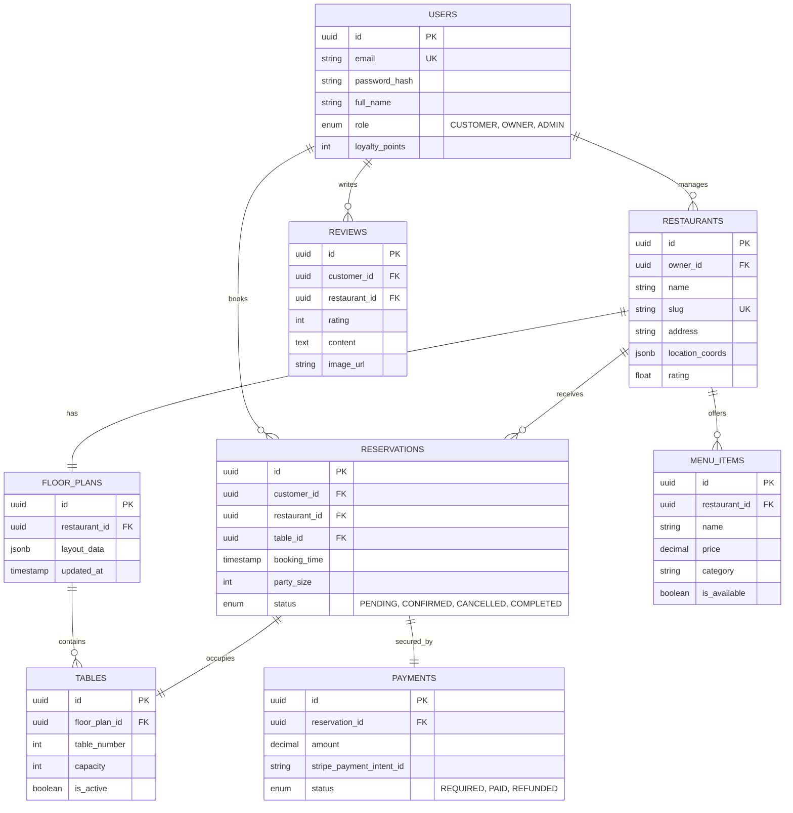

# ER Diagram - DineReserve Database Schema

### Explanation
The Entity Relationship Diagram defines the relational structure of the DineReserve ecosystem:
- **Core Entities**: `USERS` (with roles), `RESTAURANTS`, and `TABLES`.
- **Operations**: `RESERVATIONS` link customers to specific tables at specific restaurants.
- **Support Entities**: `PAYMENTS` secure reservations, `MENU_ITEMS` provide culinary details, and `REVIEWS` store user feedback.
- **Relationships**:
  - One user (Owner) can manage many restaurants.
  - One restaurant has one floor plan, which contains many tables.
  - One reservation is tied to one primary table and one payment ID.
  - JSONB fields are utilized for flexible layout data and geographic coordinates.

