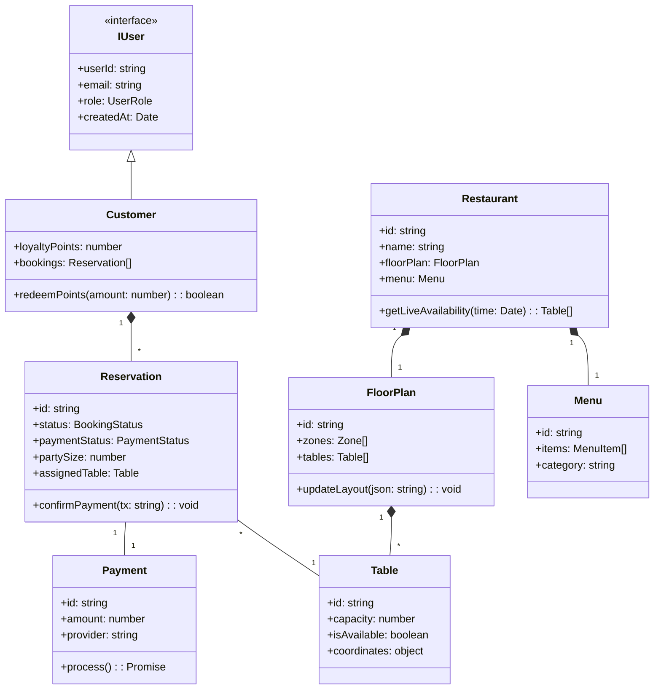

# Class Diagram - DineReserve TypeScript Architecture

```mermaid
classDiagram
    class IUser {
        <<interface>>
        +userId: string
        +email: string
        +role: UserRole
        +createdAt: Date
    }

    class Customer {
        +loyaltyPoints: number
        +bookings: Reservation[]
        +redeemPoints(amount: number): boolean
    }

    class Restaurant {
        +id: string
        +name: string
        +floorPlan: FloorPlan
        +menu: Menu
        +getLiveAvailability(time: Date): Table[]
    }

    class Reservation {
        +id: string
        +status: BookingStatus
        +paymentStatus: PaymentStatus
        +partySize: number
        +assignedTable: Table
        +confirmPayment(tx: string): void
    }

    class Payment {
        +id: string
        +amount: number
        +provider: string
        +process(): Promise<boolean>
    }

    class FloorPlan {
        +id: string
        +zones: Zone[]
        +tables: Table[]
        +updateLayout(json: string): void
    }

    class Table {
        +id: string
        +capacity: number
        +isAvailable: boolean
        +coordinates: object
    }

    class Menu {
        +id: string
        +items: MenuItem[]
        +category: string
    }

    IUser <|-- Customer
    Customer "1" *-- "*" Reservation
    Reservation "1" -- "1" Payment
    Restaurant "1" *-- "1" FloorPlan
    Restaurant "1" *-- "1" Menu
    FloorPlan "1" *-- "*" Table
    Reservation "*" -- "1" Table
```
