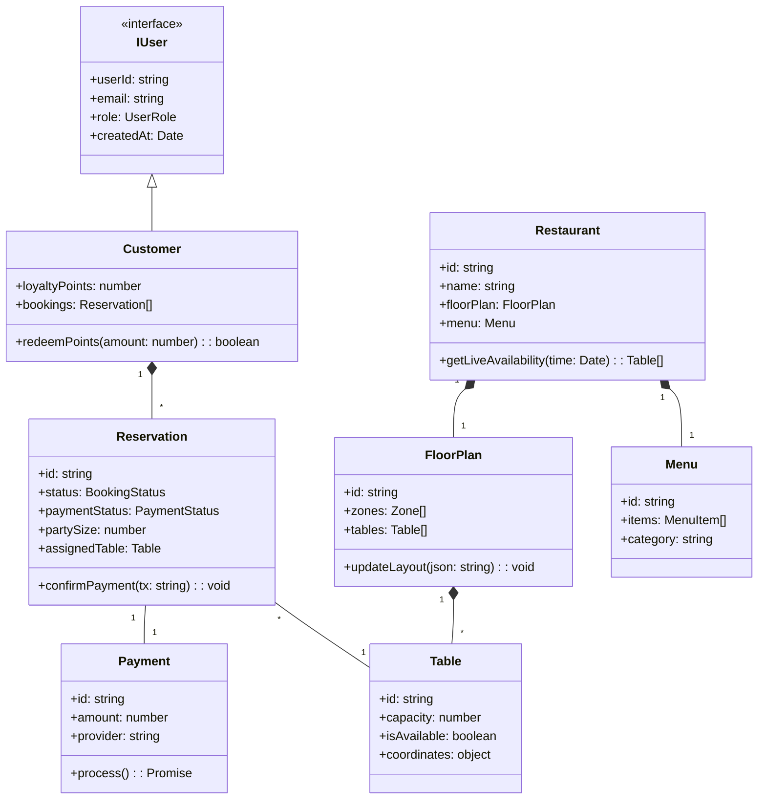

# Class Diagram - DineReserve TypeScript Architecture

### Explanation
This class diagram outlines the object-oriented structure of the TypeScript backend:
- **Interfaces**: `IUser` serves as the base contract for all system users, ensuring consistent fields like `userId` and `role`.
- **Specialization**: `Customer` extends user functionality with loyalty points and personal booking history.
- **Restaurant Management**: The `Restaurant` class aggregates `FloorPlan` and `Menu` objects to manage physical and culinary offerings.
- **Resource Entities**: `Table` and `MenuItem` represent the granular resources.
- **Transactional Logic**: `Reservation` and `Payment` handle the lifecycle of a booking, from status updates to payment confirmation.

