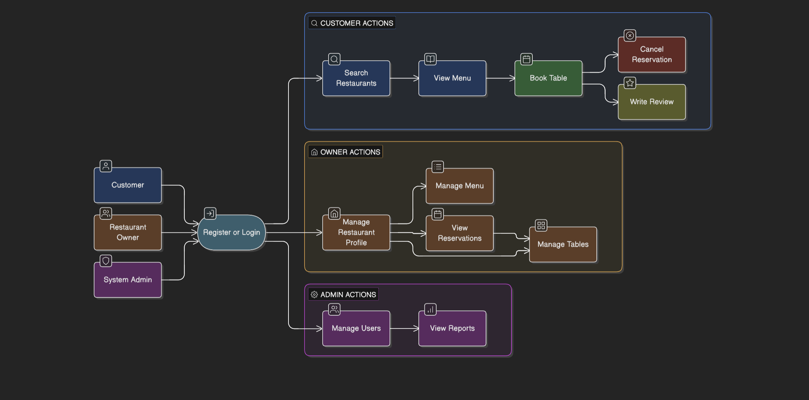
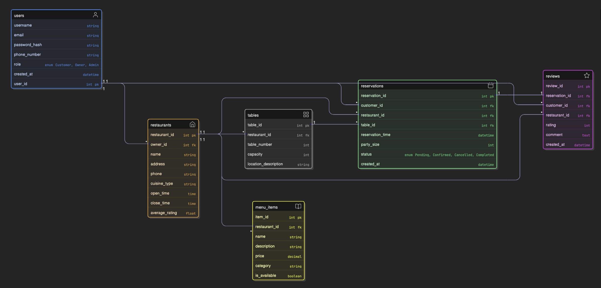
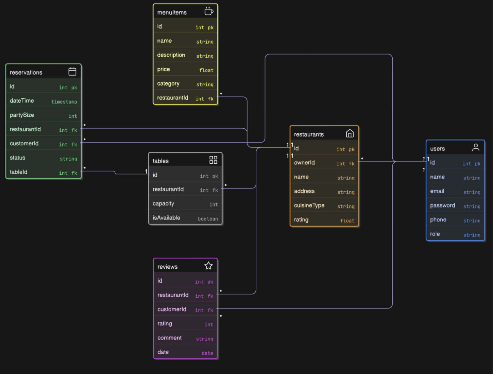
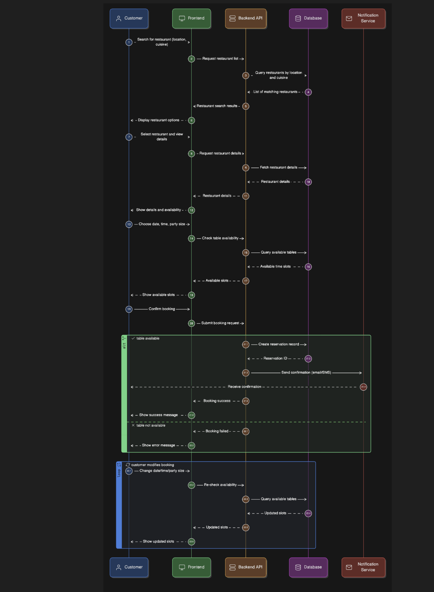

# DineReserve: A Premium Restaurant Booking Ecosystem

## 🌟 Vision
**DineReserve** is a state-of-the-art, end-to-end dining orchestration platform. Built with a focus on **type-safety, scalability, and seamless user experience**, it bridges the gap between hungry diners and the finest culinary establishments. By leveraging a modern tech stack, DineReserve ensures that every reservation is guaranteed, every menu is up-to-date, and every dining experience starts with a single, effortless click.

## 🛠 Tech Stack
The entire ecosystem is powered by **TypeScript**, ensuring maximum reliability and a robust developer experience across the full stack.

-   **Frontend:** React with TypeScript, Vite, and Tailwind CSS for a high-performance, responsive UI.
-   **Backend:** Node.js with Express & TypeScript, providing a scalable and typed API layer.
-   **Database:** MongoDB with Prisma ORM (Type-safe database access).
-   **Real-time:** Socket.io for live table availability and instant booking notifications.
-   **Authentication:** JWT-based secure authentication with Role-Based Access Control (RBAC).

---

## 🚀 Full-Fledged Features

### 1. For the Modern Diner (Customer App)
-   **Intelligent Discovery:** Geo-location-based search, advanced filtering (cuisine, price point, dietary tags), and a "Trending Near You" algorithm.
-   **Interactive Table Selection:** Digital floor plans allowing users to pick their preferred seating zone (Window, Booth, Outdoor).
-   **Real-time Availability:** No more "ghost bookings." See exactly what's open with millisecond accuracy.
-   **Seamless Payments:** Integration with Stripe/Razorpay for optional booking deposits or pre-payment of special menus.
-   **Loyalty & Rewards:** A points-based system where frequent diners earn "DineCredits" for future discounts.
-   **Social Reviews:** High-quality photo reviews, nested comments, and a "Verified Diner" badge for authentic feedback.

### 2. For the Culinary Professional (Owner Dashboard)
-   **Live Floor Management:** A drag-and-drop interface to design restaurant layouts and manage table status in real-time.
-   **Waitlist Automation:** AI-powered estimated wait times and automated SMS notifications when a table is ready.
-   **Dynamic Menu Builder:** Rich media support for menu items, seasonal toggles, and instant price updates.
-   **Performance Analytics:** Deep insights into peak hours, most popular dishes, and customer retention metrics.
-   **Staff Management:** Grant specific permissions to floor managers, hosts, and waitstaff.

### 3. For the Ecosystem Guardian (Admin Panel)
-   **Global Oversight:** Monitor system health, active bookings, and revenue flow.
-   **Restaurant Onboarding:** A streamlined KYC and verification process for new restaurant partners.
-   **Dispute Resolution:** Tools to handle booking conflicts or fraudulent reviews.
-   **Platform-wide Promotions:** Manage banner ads, featured restaurants, and seasonal marketing campaigns.

---

## 🔒 Non-Functional Requirements
-   **Type Safety:** 100% TypeScript coverage to eliminate runtime errors.
-   **Security:** AES-256 encryption for sensitive data and CSRF protection.
-   **Scalability:** Microservices-ready architecture to handle thousands of concurrent bookings.
-   **Accessibility:** WCAG 2.1 compliant UI to ensure the platform is usable by everyone.

## 🗺 Roadmap
-   **Phase 1:** Core Authentication & Basic CRUD for Restaurants/Menus.
-   **Phase 2:** Real-time Booking Engine & Notification Service.
-   **Phase 3:** Payment Integration & Loyalty Program.
-   **Phase 4:** Mobile App (React Native) & AI-driven Recommendations.
---

## 🖼 Visual Architecture

### 1. System Use Cases

*Visualizes the primary interactions between diners, owners, and the platform.*

### 2. Database Schema (ERD)

*The relational structure ensuring data integrity across users, bookings, and payments.*

### 3. Application Class Structure

*High-level TypeScript class hierarchy for the backend ecosystem.*

### 4. Booking Sequence Flow

*Detailed transaction flow for a secure, real-time table reservation.*
