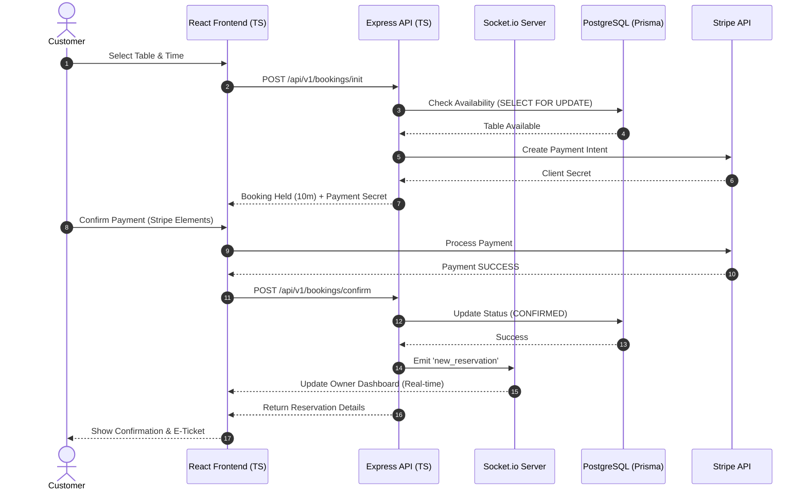

# Sequence Diagram - Advanced Booking & Payment Flow

```mermaid
sequenceDiagram
    autonumber
    actor C as Customer
    participant FE as React Frontend (TS)
    participant API as Express API (TS)
    participant Socket as Socket.io Server
    participant DB as PostgreSQL (Prisma)
    participant Stripe as Stripe API

    C->>FE: Select Table & Time
    FE->>API: POST /api/v1/bookings/init
    API->>DB: Check Availability (SELECT FOR UPDATE)
    DB-->>API: Table Available
    
    API->>Stripe: Create Payment Intent
    Stripe-->>API: Client Secret
    
    API-->>FE: Booking Held (10m) + Payment Secret
    
    C->>FE: Confirm Payment (Stripe Elements)
    FE->>Stripe: Process Payment
    Stripe-->>FE: Payment SUCCESS
    
    FE->>API: POST /api/v1/bookings/confirm
    API->>DB: Update Status (CONFIRMED)
    DB-->>API: Success
    
    API->>Socket: Emit 'new_reservation'
    Socket-->>FE: Update Owner Dashboard (Real-time)
    
    API-->>FE: Return Reservation Details
    FE-->>C: Show Confirmation & E-Ticket
```
