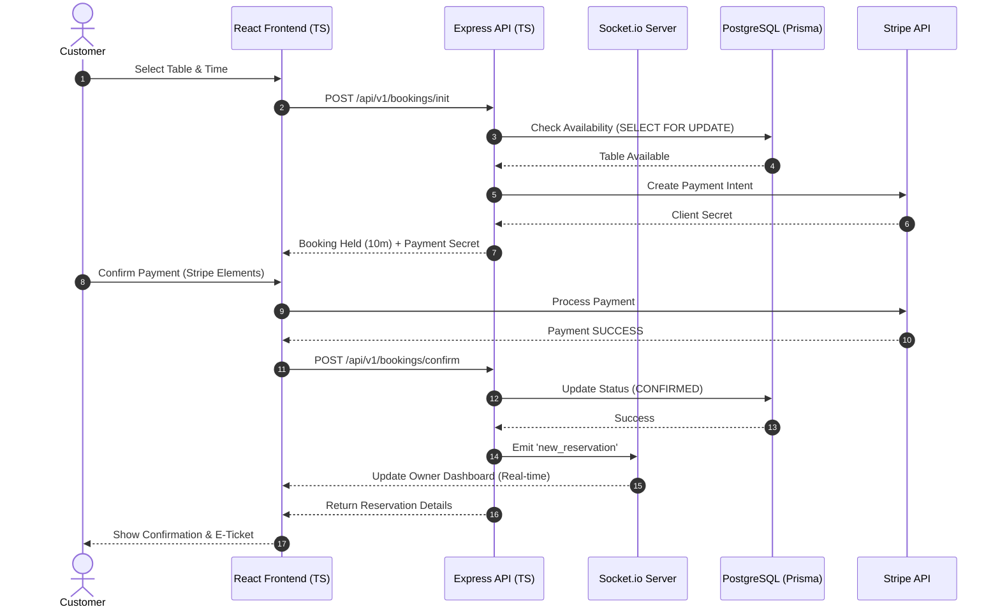

# Sequence Diagram - Advanced Booking & Payment Flow

### Explanation
This sequence diagram details the end-to-end flow of booking a table with integrated payments:
1. **Initiation**: The customer selects a table and time on the React frontend, which sends a request to the Express API.
2. **Availability Check**: The API performs a type-safe check against the PostgreSQL database using a "SELECT FOR UPDATE" lock to prevent double booking.
3. **Payment Setup**: A Stripe Payment Intent is created to hold the table for a limited time (e.g., 10 minutes).
4. **Transaction**: The customer completes the payment via Stripe Elements. Once successful, the frontend notifies the API.
5. **Confirmation**: The API updates the reservation status in the database and broadcasts a 'new_reservation' event via Socket.io to the restaurant owner's dashboard in real-time.
6. **Finalization**: The customer receives an immediate confirmation and an digital e-ticket.

